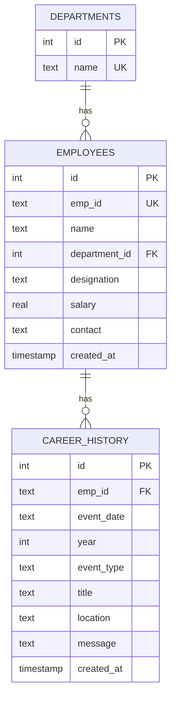

# Employee Management System 

A full-stack, editorial HR internal portal mini-project built with **Python Flask**, **SQLite (sqlite3)**, and **Plain Vanilla HTML5 / CSS3 / JavaScript** (No React / frontend frameworks). Node.js is utilized solely for tooling (`package.json` with a dev server on port 3000).

Now features a **Career & Work History Portal** matching the modern HR workforce profile UI (profile header banner, live work timer, reporting hierarchy, teammate status, and interactive career timeline with milestone updates).

---

## 1. Project Overview & Architecture

```
employee-management/
├── backend/
│   ├── app.py              # Flask REST API, CORS configuration, career history & routes
│   ├── database.py         # SQLite connection, normalized schema DDL & seed data
│   ├── requirements.txt    # Python dependencies (flask, flask-cors)
│   └── employees.db        # SQLite database (auto-generated on first run)
├── frontend/
│   ├── index.html          # Semantic HTML structure, profile hub & modal/drawer
│   ├── css/style.css       # Editorial HR styling, career timeline cards & responsive UI
│   ├── js/app.js           # Fetch API integration, SPA view switcher, live timer & history manager
│   └── img/
│       └── office-bg.jpg   # Real office background photograph
├── package.json            # Node dev script to serve frontend on port 3000
└── README.md               # Project documentation, API reference & viva guide
```

### Architecture Highlights
- **Single Page Application (SPA)**: Smooth instantaneous switching between **Staff Directory** and **Employee Profile & Career History** with zero page reloads.
- **Pure JavaScript & CSS**: Zero frontend build lock-in; uses native Fetch API, CSS Grid/Flexbox, and CSS Variables.
- **Safe Database Interactions**: 100% parameterized queries (`?` place-holders) preventing SQL injection attacks.
- **Strict Dual Validation**: Parallel client-side and server-side validation ensuring data integrity.
- **HR Workforce Profile View**: Matches modern enterprise portals (like Zoho People / Darwinbox / Workday) with:
  - Overlapping profile avatar & department badge
  - Real-time ticking work timer (`08 : 08 : 17`) with `Check-out` / `Check-in` toggle
  - Live status indicator (`Present` / `Remote` / `On Leave`)
  - Manager hierarchy card ("Reporting To") & colleague list ("Teammates & Reportees")
  - Multi-tab navigation: `Career History`, `Profile Dossier`, `Activities`, `Leave & Attendance`, `Timesheets`
  - Vertical timeline grouped by year (`2024`, `2023`...) with colored cards for Location Updates, Designation Changes, Department Transfers, and Project Deliverables.
  - Interactive **Add Milestone Modal** to log new work updates at any time.

---

## 2. Database Design (Normalized Schema)

The database schema is normalized to **3NF (Third Normal Form)** with referential integrity (`PRAGMA foreign_keys = ON`).



### Schema Definition (DDL)

```sql
-- Departments Master Table
CREATE TABLE IF NOT EXISTS departments (
    id   INTEGER PRIMARY KEY AUTOINCREMENT,
    name TEXT NOT NULL UNIQUE
);

-- Employees Transactional Table
CREATE TABLE IF NOT EXISTS employees (
    id            INTEGER PRIMARY KEY AUTOINCREMENT,
    emp_id        TEXT NOT NULL UNIQUE,
    name          TEXT NOT NULL,
    department_id INTEGER NOT NULL,
    designation   TEXT NOT NULL,
    salary        REAL NOT NULL CHECK (salary > 0),
    contact       TEXT NOT NULL,
    created_at    TIMESTAMP DEFAULT CURRENT_TIMESTAMP,
    FOREIGN KEY (department_id) REFERENCES departments(id)
);

-- Career & Work History Table
CREATE TABLE IF NOT EXISTS career_history (
    id            INTEGER PRIMARY KEY AUTOINCREMENT,
    emp_id        TEXT NOT NULL,
    event_date    TEXT NOT NULL,
    year          INTEGER NOT NULL,
    event_type    TEXT NOT NULL, -- 'location', 'designation', 'department', 'project', 'milestone'
    title         TEXT NOT NULL,
    location      TEXT,
    message       TEXT NOT NULL,
    created_at    TIMESTAMP DEFAULT CURRENT_TIMESTAMP,
    FOREIGN KEY (emp_id) REFERENCES employees(emp_id) ON DELETE CASCADE
);
```

### Seed Data
- **Departments (6)**: `Engineering`, `HR`, `Finance`, `Marketing`, `Operations`, `Sales`.
- **Employees (8 Indian Profiles)**:
  1. `EMP001` · Ananya Sharma · Engineering · Software Engineer · ₹9,20,000.00 · 9876543210
  2. `EMP002` · Rohan Mehta · Finance · Financial Analyst · ₹7,80,000.50 · 9123456789
  3. `EMP003` · Priya Nair · HR · HR Business Partner · ₹8,50,000.00 · 8890123456
  4. `EMP004` · Arjun Reddy · Sales · Account Executive · ₹6,40,000.00 · 7012345678
  5. `EMP005` · Meera Iyer · Marketing · Brand Manager · ₹9,10,000.00 · 9988776655
  6. `EMP006` · Vikram Singh · Operations · Operations Lead · ₹10,20,000.00 · 8123456789
  7. `EMP007` · Sneha Patil · Engineering · QA Engineer · ₹7,10,000.00 · 9765432109
  8. `EMP008` · Karan Joshi · Finance · Payroll Specialist · ₹5,60,000.00 · 6234567890
- **Career History**: Seeded milestones for all employees. For instance, `EMP003` (Priya Nair) includes:
  - `19 December 2024` · Location: Dubai · *"Your Location has been updated"*
  - `17 May 2024` · Designation: HR Head · *"Your Designation has been updated"*
  - `05 March 2024` · Department: Human Resources · Location: California · *"Your Department, Location have been updated"*

---

## 3. Installation & Run Guide

### Prerequisites
- **Python 3.10+**
- **Node.js 18+**

Open two separate terminals from the project root (`employee-management`).

### Terminal 1: Backend Server (Port 5000)

#### Windows (PowerShell):
```powershell
cd backend
python -m venv .venv
.\.venv\Scripts\Activate.ps1
pip install -r requirements.txt
python app.py
```

#### macOS / Linux:
```bash
cd backend
python3 -m venv .venv
source .venv/bin/activate
pip install -r requirements.txt
python app.py
```
> The Flask API will start at **http://127.0.0.1:5000**. On initial startup, `employees.db` is automatically created and seeded.

---

### Terminal 2: Frontend Dev Server (Port 3000)

From the project root:
```powershell
npm run dev
```
> The frontend will be served at **http://localhost:3000**.
> Open **http://localhost:3000** in your browser to interact with the system.

---

## 4. REST API Specification

Base URL: `http://127.0.0.1:5000`

| Method | Endpoint | Status Codes | Description |
|:-------|:---------|:-------------|:------------|
| `GET` | `/api/employees` | `200 OK`, `500` | List all employees (joins `departments` table). |
| `GET` | `/api/employees/<emp_id>` | `200 OK`, `404` | Retrieve detailed employee dossier, reporting manager, teammates, and career history. |
| `GET` | `/api/employees/search?q=&department=` | `200 OK`, `500` | Search across `emp_id`, `name`, `department`, or `designation`. |
| `POST` | `/api/employees` | `201 Created`, `400`, `409` | Create a new employee record (`409` on duplicate `emp_id`). |
| `PUT` | `/api/employees/<emp_id>` | `200 OK`, `400`, `404` | Update an existing employee (`404` if not found). |
| `DELETE` | `/api/employees/<emp_id>` | `200 OK`, `404` | Delete an employee by ID (`404` if not found). |
| `GET` | `/api/employees/<emp_id>/history` | `200 OK`, `404` | Fetch career & work history timeline for an employee. |
| `POST` | `/api/employees/<emp_id>/history` | `201 Created`, `400`, `404` | Add a new work milestone or career event for an employee. |
| `DELETE` | `/api/history/<id>` | `200 OK`, `404` | Delete a single career history milestone. |
| `GET` | `/api/departments` | `200 OK`, `500` | Fetch list of departments for dropdown filter and editor options. |
| `GET` | `/api/stats` | `200 OK`, `500` | Summary metrics: total employees, department count, average salary (INR), and department headcounts. |

---

## 5. Test Cases Table

| # | Test Scenario | Request Example / Action | Expected HTTP Status | Expected JSON / UI Response |
|:-:|:--------------|:-------------------------|:--------------------:|:----------------------------|
| **1** | **Duplicate `emp_id`** | `POST /api/employees`<br>`{"emp_id":"EMP001", "name":"Duplicate", "department":"HR", "designation":"Manager", "salary":50000, "contact":"9876543210"}` | **409 Conflict** | `{"success": false, "error": "Employee ID EMP001 already exists."}` |
| **2** | **Invalid Contact Number** | `POST /api/employees`<br>`{"emp_id":"EMP099", "name":"Test User", "department":"HR", "designation":"Lead", "salary":50000, "contact":"12345"}` | **400 Bad Request** | `{"success": false, "error": "Validation failed.", "fields": {"contact": "Contact must be exactly 10 digits and start with 6, 7, 8, or 9."}}` |
| **3** | **Negative Salary** | `POST /api/employees`<br>`{"emp_id":"EMP099", "name":"Test User", "department":"Finance", "designation":"Analyst", "salary":-5000, "contact":"9876543210"}` | **400 Bad Request** | `{"success": false, "error": "Validation failed.", "fields": {"salary": "Salary must be greater than 0."}}` |
| **4** | **Delete Non-Existent Employee** | `DELETE /api/employees/EMP999` | **404 Not Found** | `{"success": false, "error": "No employee found with ID EMP999."}` |
| **5** | **Search With No Results** | `GET /api/employees/search?q=NonExistentQuery` | **200 OK** | `{"success": true, "data": []}`<br>UI displays: *"No employees match your search"* |
| **6** | **Update Non-Existent Employee** | `PUT /api/employees/EMP999`<br>`{"name":"Valid Name", "department":"HR", "designation":"Lead", "salary":60000, "contact":"9876543210"}` | **404 Not Found** | `{"success": false, "error": "No employee found with ID EMP999."}` |
| **7** | **Add Milestone to Employee** | `POST /api/employees/EMP003/history`<br>`{"event_date":"19 October", "year":2024, "event_type":"location", "title":"Dubai Hub", "location":"Dubai", "message":"Your Location has been updated"}` | **201 Created** | `{"success": true, "data": {"id": ..., "event_type": "location"}}` |
